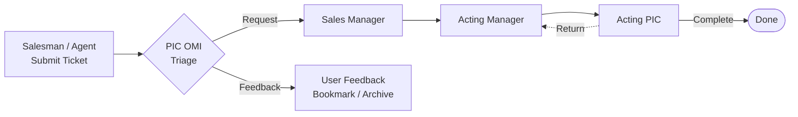

<div align="center">


# Dcota Care

**Internal Helpdesk & Approval Management System**

An end-to-end ticketing platform — from submission and triage through a multi-level approval chain — designed to be fast, auditable, and role-aware.

<p>
  
  
  
  
  
  
  
</p>

</div>

---

## 📖 Overview

**Dcota Care** is a production internal web application that manages operational requests through a structured ticketing and approval workflow. Users submit tickets, attach supporting files, and track status in real time, while every state transition is recorded as a complete audit trail.

It is a full-stack application built on the **Next.js App Router** with a **PostgreSQL** database (via Prisma), role-based access control (**RBAC**), attachment storage on **Cloudflare R2**, and analytics powered by **Google BigQuery**. The system is currently deployed on Vercel and serves internal sales & operations teams (~500 users).

> The user-facing interface is written in **Indonesian**, serving an Indonesian sales organization.

## ✨ Key Features

- 🔐 **Authentication & RBAC** — credentials-based login with 9 distinct roles
- 🎫 **Ticket submission & tracking** — categories, sub-categories, attachments, store metadata
- 🔀 **Smart triage** — classification into *Request* or *Feedback* paths
- ✅ **Multi-level approval chain** — Sales Manager → Acting Manager → Acting PIC
- 🗺️ **Category-based routing** — tickets are routed to the correct division automatically
- 📎 **File attachments** — direct-to-storage uploads via presigned URLs (Cloudflare R2)
- 📧 **Email notifications** — automatic assignment alerts over SMTP
- 📊 **Analytics** — scheduled sync to BigQuery for reporting dashboards
- 📝 **Audit trail** — every action is written to an immutable ticket log

## 🛠️ Tech Stack

| Category | Technology |
| --- | --- |
| **Framework** | Next.js 16 (App Router), React 19 |
| **Styling & UI** | Tailwind CSS 4, Headless UI, Heroicons, Lucide, Sonner |
| **Authentication** | NextAuth.js (Credentials + JWT), bcryptjs |
| **Database & ORM** | PostgreSQL, Prisma (with Accelerate) |
| **Storage** | Cloudflare R2 (S3-compatible) via a Go serverless function |
| **Email** | Nodemailer (SMTP) |
| **Analytics** | Google BigQuery |
| **Deployment** | Vercel (+ Vercel Cron) |

## 🔄 Ticket Lifecycle



Each ticket moves through a chain of *assignments*, and every transition writes a log entry — so the full history of any request is always traceable.

## 👥 User Roles

| Role | Responsibility |
| --- | --- |
| **Administrator** | User & master-data management, analytics |
| **Salesman / Agent** | Submit tickets |
| **PIC OMI / PIC OMI (SS)** | Triage tickets (Request / Feedback) |
| **Sales Manager** | First-level approval |
| **Acting Manager** | Division-level approval (routed per category) |
| **Acting PIC** | Final resolution or return to manager |
| **User Feedback** | Handle feedback-type tickets |

## 🏗️ Architecture Highlights

- **Per-route authorization** — every API route enforces its own role check against the session, keeping authorization explicit and colocated with each endpoint.
- **Assignment-driven lifecycle** — a user's work queue is simply their *pending* assignments; status transitions are append-only and fully logged.
- **Category → division smart routing** — a single mapping layer decides which Acting Manager / Acting PIC division handles each ticket.
- **Presigned uploads** — a lightweight Go serverless function issues time-limited PUT URLs to R2, so file bytes never pass through the app server.
- **Non-blocking side effects** — emails and follow-up assignments are dispatched after the main transaction, never blocking the response path.
- **Scheduled analytics sync** — a Vercel Cron job pushes ticket data to BigQuery for the reporting layer.

## 🚀 Getting Started

### Prerequisites

- Node.js & npm
- PostgreSQL

### Installation

```bash
# 1. Clone the repository
git clone https://github.com/xxndrew-mr/dcota-care.git
cd dcota-care

# 2. Install dependencies
npm install

# 3. Configure environment (Postgres, NextAuth, SMTP, R2, BigQuery)
cp .env.example .env

# 4. Set up the database
npx prisma migrate dev      # run migrations
npx prisma generate         # generate Prisma Client
npx prisma db seed          # seed roles, divisions & initial users

# 5. Start the development server
npm run dev                 # http://localhost:3000
```

### Other Commands

```bash
npm run build               # production build
npx eslint .                # lint
node scripts/etl-to-bigquery.js   # manual ETL to BigQuery
```

## 📁 Project Structure

```
src/
  app/
    login/            Login page
    dashboard/        Protected pages (submit, queue, my-tickets, admin, …)
    api/              Route handlers (auth, tickets, assignments, admin, cron)
  lib/                Prisma, auth, smart routing, email, utils
  middleware.js       Guards /dashboard/* pages
prisma/               schema.prisma, migrations, seed
api/go-upload.go      Vercel Go function: presigned R2 upload URLs
```

## 👤 Author

**Andre Marshandito** — Software Engineer
GitHub: [@xxndrew-mr](https://github.com/xxndrew-mr)

---

<div align="center">
<sub>Built with Next.js, Prisma & PostgreSQL — deployed on Vercel.</sub>
</div>
