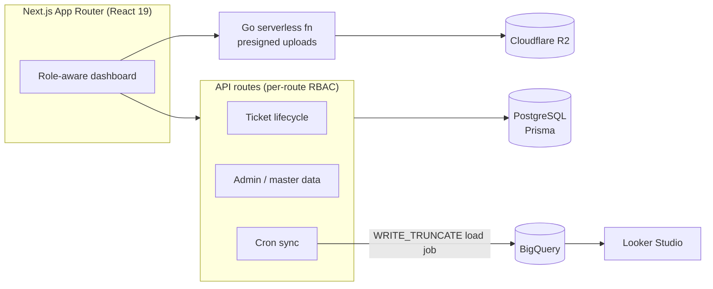

# Case Study — Dcota Care

**An internal helpdesk & approval management system serving ~400 field sales users in production.**

> Next.js 16 (App Router) · React 19 · PostgreSQL + Prisma · NextAuth · Cloudflare R2 · Go serverless · Google BigQuery · Vercel

---

## 1. Context

Field salespeople and agents need a single, auditable channel to report product issues, commission questions, and tooling requests — and management needs every request to pass through the *right* approval chain, not an inbox. Dcota Care turns that flow into a structured ticketing system:

- **Submitters** (Salesman / Agent) file tickets with categories and attachments.
- **Triage officers** (PIC OMI) classify each ticket as a *Request* (needs approval) or *Feedback* (needs review).
- **Requests** climb a three-stage approval chain: Sales Manager → Acting Manager → Acting PIC, where the responsible division is selected automatically from the ticket category.
- **Feedback** goes to a review team that bookmarks or archives it.
- Every transition is written to an append-only audit log.

The system runs in production on Vercel and serves roughly **400 users across 9 distinct roles**.

## 2. Architecture at a glance

## 3. Key engineering decisions

### Assignment-driven workflow
A ticket's position in the lifecycle is expressed as rows in `TicketAssignment` (`Active` for the approval chain, `Feedback_Review` for the review path). A user's work queue is simply *their pending assignments* — no state machine tables, no polling logic. Every transition also appends a `TicketLog` row, so the full history of any ticket is reconstructable.

### Authorization colocated with each endpoint
Middleware only gates the `/dashboard/*` pages; **every API route performs its own session + role check** before touching data. Authorization is explicit, greppable, and reviewable per endpoint instead of hidden behind a framework layer.

### BigInt identifiers with a serialization boundary
Ticket-related tables use `BigInt` primary keys. Since `JSON.stringify` cannot serialize BigInt, all responses pass through a single shared `serialize()` helper (`src/lib/serialize.js`) that converts BigInt → string at the API boundary.

### Files never touch the app server
Attachments upload straight from the browser to Cloudflare R2 using presigned PUT URLs issued by a small **Go serverless function**. The function authenticates callers by delegating cookie validation to NextAuth's own `/api/auth/session` endpoint (no JWT crypto re-implemented in Go), restricts CORS to the deployment's own origin, and signs the declared `Content-Length` so the 100 MB limit is enforced by R2 itself.

### Category → division smart routing
A single mapping (`src/lib/smartRouting.js`) decides which Acting Manager / Acting PIC division owns each ticket category. Routing rules live in one file instead of being scattered through handlers.

### Duplicate-free analytics pipeline
A Vercel Cron endpoint snapshots all tickets to BigQuery using **`WRITE_TRUNCATE` load jobs** — each sync fully replaces the table, so the analytics layer (Looker Studio) is always a consistent, duplicate-free mirror regardless of how often the sync runs.

### Non-blocking side effects
Emails and follow-up assignment creation are dispatched *after* the main transaction commits and are never awaited in the response path — a slow SMTP server can't slow down a ticket approval.

## 4. Hardening a live system

With the app already in production, I ran a full-codebase audit (every route, page, and script) and fixed **35+ verified defects in prioritized batches, with zero downtime** — each batch verified against a green build/lint baseline before moving on. Highlights:

**Correctness**
- Two endpoints returned raw Prisma models containing BigInt — guaranteed HTTP 500 the moment data existed. Routed them through the shared serializer.
- Reactivating a user re-submitted their bcrypt hash, which was then re-hashed — permanently locking the account. The status-toggle flow was rebuilt (dedicated soft-delete `DELETE` handler + minimal `PUT` payload).
- The approval-chain email rendered `undefined` fields because it received an assignment object instead of the ticket.

**Security**
- The admin users API returned **bcrypt password hashes** to the browser — removed via Prisma `omit` on every response.
- The upload endpoint had **no authentication and wildcard CORS** — now session-validated with same-origin CORS.
- Login errors distinguished "unknown username" from "wrong password" (username enumeration) — unified.
- Internal `error.message` / Prisma error codes leaked in 500 responses across routes — replaced with generic messages (full detail stays in server logs).

**Workflow integrity**
- A Sales Manager could approve a *Feedback* ticket into the approval chain because the assignment lookup didn't filter `assignment_type`.
- A triage officer could re-triage a ticket already deep in the approval chain, silently destroying an approver's pending work — fixed with a stage guard plus a **conditional update inside the transaction** (`WHERE type = 'Pending'`), which also closes the double-triage race: concurrent triage now updates 0 rows and fails cleanly.
- Triage could close all pending assignments and *then* discover no next assignee existed, leaving the ticket orphaned with a 200 response — routing targets are now resolved and validated before anything is mutated.

**Data**
- The per-minute BigQuery sync used append-only streaming inserts — the analytics table grew duplicates forever. Replaced with `WRITE_TRUNCATE` load jobs (and the manual ETL script was aligned to the same schema and env-based credentials).

## 5. Quality gates

- **Unit tests (Vitest)** over the pure domain logic: category routing, BigInt serialization, date formatting, class-name merging.
- **CI (GitHub Actions)**: ESLint + Vitest + `next build` on every push/PR, plus `go vet`/`go build` for the upload function.
- **Config hygiene**: no credentials or account-specific endpoints in code — everything comes from documented environment variables (`.env.example`), and the upload function fails fast with a clear error when misconfigured.

## 6. Roadmap

- Consolidate the three approval-stage handlers (~90% structural overlap) into a parameterized workflow helper.
- Extract a `requireRole()` helper and shared UI primitives (status badge, attachment chip, stat blocks).
- Add integration tests around the ticket lifecycle with a disposable Postgres.
- Error monitoring (e.g. Sentry) on top of the existing structured server logs.

---

*Author: **Andre Marshandito** — [github.com/xxndrew-mr](https://github.com/xxndrew-mr)*
